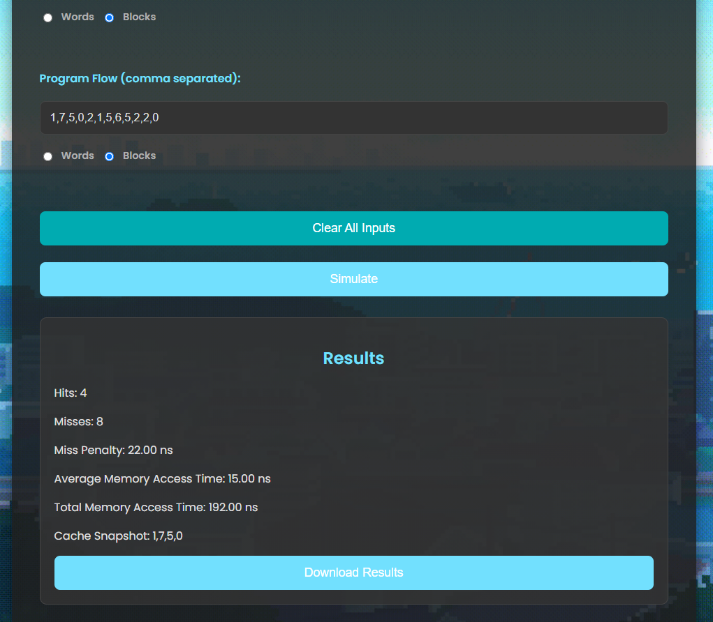
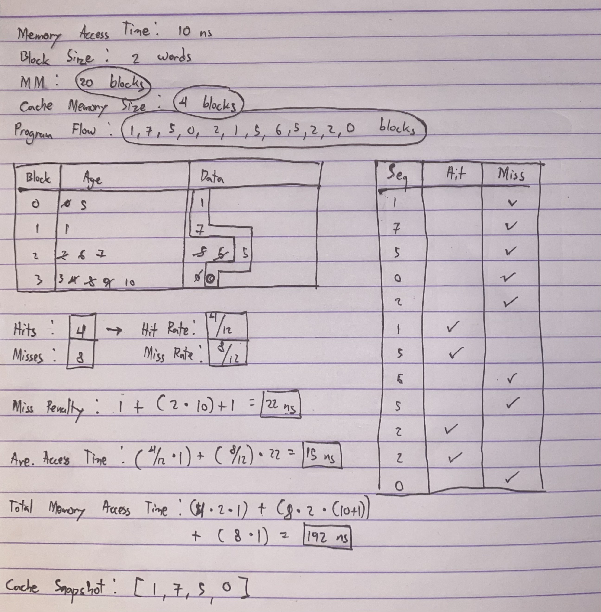
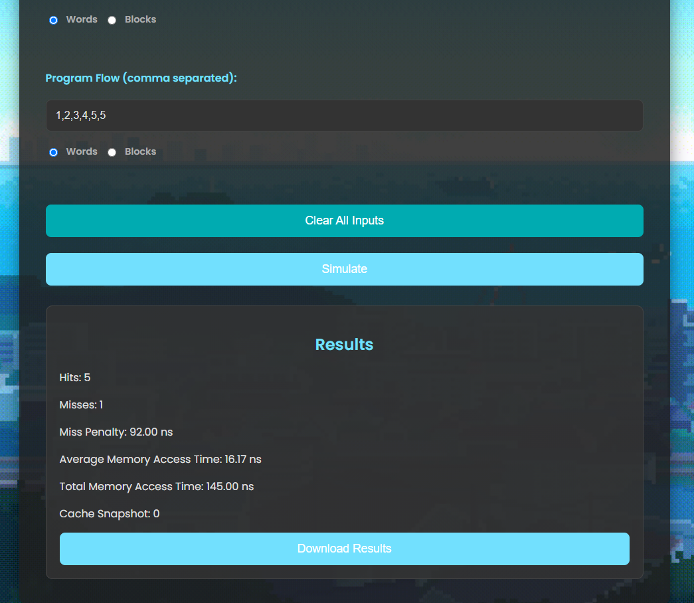
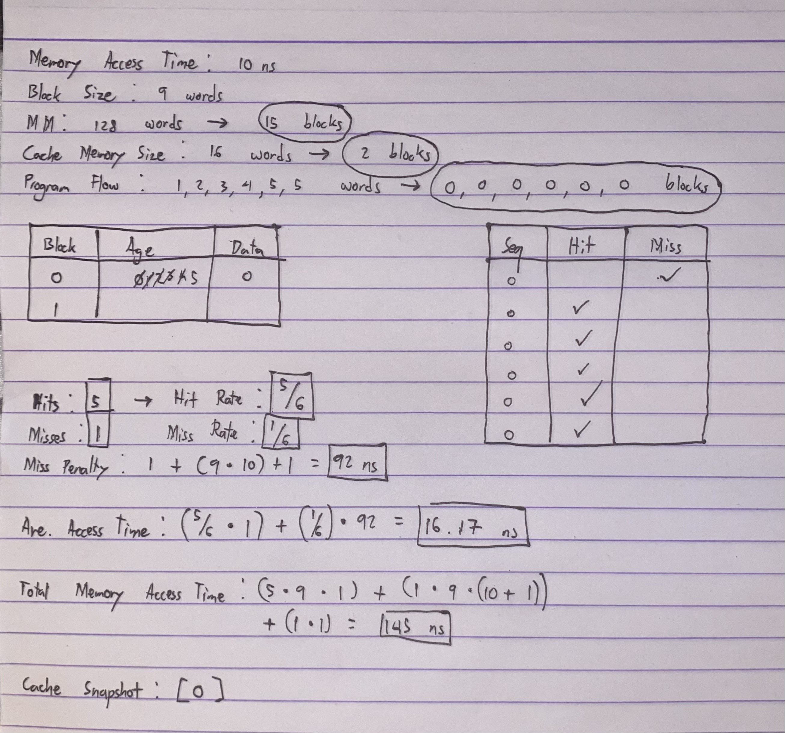

# CSARCH2-Simulation-Project
## Overview
The cache simulator is an interactive web app designed to emulate a full associative cache memory system with a Most Recently Used (MRU) replacement policy, and a Non-Load-Through read policy.

## System Specifications
* Mapping Function == Full Associative
* Replacement Algorithm == Most Recently Used (MRU)
* Read Policy == Non-Load-Through
* Cache Access Time == 1 ns
* Memory Access Time == User Input
* Block Size (in words) == User Input
* Main Memory Size (either words or blocks) == User Input
* Cache Memory Size (either words or blocks) == User Input
* Program Flow (either words or blocks) == User Input

## How the Application Works
1. Input Memory Access Time.
2. Input Block Size.
3. Input Main Memory Size (choose either words or blocks).
4. Input Cache Memory Size (choose either words or blocks).
5. Input Program Flow (comma separated and choose either words or blocks).
6. Click the "Simulate" button to generate results - Hits, Misses, Miss Penalty, Average Access Time, and Total Memory Access Time.

LINK To the Website: [https://cache-sim-full-associative-mru.netlify.app/](https://cache-sim-full-associative-mru.netlify.app/)

## DEMO

## Formulas Used

    1. missPenalty = cacheAccessTime + (blockSize × memoryAccessTime) + cacheAccessTime
    2. avgMemoryAccessTime = (hits / totalAccesses) × cacheAccessTime + (misses / totalAccesses) × missPenalty
    3. totalMemoryAccessTime = (hits × blockSize × cacheAccessTime) + (misses × blockSize × (cacheAccessTime + memoryAccessTime)) + (misses × cacheAccessTime)
    4. word-to-block-conversion = ceiling-of (mainMemorySize or cacheMemorySize / blockSize)
    5. program-flow-word-to-block-conversion = floor of (programFlow[n] / blockSize)

## Test Case Analysis
The app accepts both blocks and words as input for the Main Memory Size, Cache Memory Size, and Program Flow. The user has to simply tick either of the 2 aforementioned options so that the app can determine whether the inputs are in words or blocks.

### Case #1
The user's inputs are in BLOCKS; specifically, the Main Memory Size (MM), Cache Memory Size (CMS), and Program Flow. If the aforementioned parameters are already in blocks, no word-to-block conversion will be done for the input values.

    Memory Access Time: 10ns
    Block Size (always in words): 2 words
    MM: 20 blocks
    CMS: 4 blocks
    Program Flow: 1,7,5,0,2,1,5,6,5,2,2,0

These are the results from the app which are consistent with the manual paper-and-pen computation below.

### Case #2
The user's inputs are in WORDS; specifically, the Main Memory Size (MM), Cache Memory Size (CMS), and Program Flow. If the aforementioned parameters are in words, word-to-block conversion will be done for the input values [See Formula for Word-To-Block](#Formulas Used)

    Memory Access Time: 10ns
    Block Size (always in words): 9 words
    MM: 128 words
    CMS: 16 words
    Program Flow: 1,2,3,4,5,5 words

These are the results from the app which are consistent with the manual paper-and-pen computation below.

